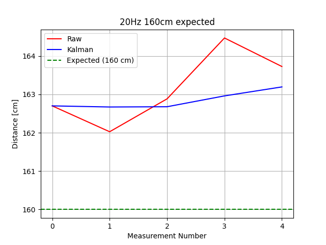

# RdLib Library for Rd03d and HLK-LD2450 for raspberrypi

For now library is using only serial communication with these radars. 
Might be necessary to set temporarily permission to the serial port:
- sudo chmod 777 /dev/ttyS0

How to install that library?
- pip install RdLib

Whole library is preconfigured to both radar. Just plug&play
But to be specific here is documentation about implementation: 

-Basic implementation  without any configuration

    from RdLib.Rd import Rd 
    rd = Rd()
    
    print(rd.get_angle())
        """
        Calculates the angle between the radar and the detected object in degrees.

        Returns:
            float: Angle in degrees.
        """
    
    print(rd.get_coordinate())
        """
        Reads radar data and returns the 2D coordinates of the detected object.

        Returns:
            tuple: (x, y) coordinates in meters.
        """
    
    print(rd.OutputDump())
        """
        Returns a full snapshot of radar data.

        Returned values:
            - x (float): X coordinate of the object
            - y (float): Y coordinate of the object
            - distance (float): Converted distance from the radar to the object
            - angle (float): Angle to the object in degrees
            - detection_mode (float): Current radar detection mode
            - raw_distance (float): Raw distance (before conversion)

        Returns:
            tuple: (x, y, distance, angle, detection_mode, raw_distance)
        """
    
    print(rd.get_distance())
        """
        Reads radar data and calculates the distance to the detected object.

        Returns:
            float: Distance to the object in meters.
        """
    
    print(rd.Kalman_Test(100,1,5,"Test2","Test2"))
         """
        Runs a Kalman filter test on distance measurements and visualizes the results.

        Parameters:
        - true_length (float): Expected distance in cm (used as a reference line on the chart).
        - measure_frequency (float): Delay between measurements in seconds.
        - quantity_measure (int): Number of total measurements.
        - chart_comment (str): Title of the chart.
        - file_name (str): Name used to save CSV and chart image.

        Behavior:
        - Collects distance measurements (raw and filtered).
        - Plots real-time updates of both raw and Kalman-filtered data.
        - Saves data to CSV and chart to PNG if configured to do so.
        """
    
    print(rd.Calibrate_Kalman())
            """
        That function gives you raw data from radar compared to the filtered by kalman.
        Important you must turn on kalman by config.set(Kalman=True)

        Returns:
            tuple: A tuple containing two sub-tuples:
                - (distance_raw_x, distance_raw_y): Raw (unfiltered) distance values.
                - (distance_filtered_x, distance_filtered_y): Filtered distance values.
        """
-Advanced implementation with config.
Example:

      from RdLib.Rd import Rd 
      from RdLib.config import config

      
      #Example of Entry Configuration
      config.set(Kalman_Save_csv=False)
      config.set(Kalman=True)
      config.set(distance_units="cm") 
      rd = Rd()

      print(rd.get_angle())
      print(rd.get_coordinate())
      print(rd.OutputDump())
      print(rd.get_distance())
      print(rd.Kalman_Test(100,1,5,"Test2","Test2"))
      print(rd.Calibrate_Kalman())

Description about all config settings:

        # If False, the Kalman filter is disabled in all types of measurements.
        # If True, the Kalman filter is enabled in all types of measurements.
        self.Kalman = False

        # Path where graphs from the Kalman test function will be saved.
        self.Kalman_Chart_Path = '~/Documents/Kalman_Test'

        # If False, the program will not save measurements to a CSV file at the path above.
        self.Kalman_Save_csv = False

        # Q matrix for the Kalman filter – adjusts filter responsiveness.
        self.Kalman_Q = np.diag([0.1, 0.1, 0.1, 0.1])

        # R matrix for the Kalman filter – represents measurement noise; higher values mean more trust in predictions than measurements.
        self.Kalman_R = np.diag([50, 50])

        # Path to the Raspberry Pi serial port.
        self.Serial_Port = '/dev/ttyS0'

        # Baud rate for communication with Rd03D and HLK-LD2450 radars.
        self.Serial_Speed = '256000'

        # Communication type: "Serial" or "Gpio" GPIO is not supported in that version
        self.ctype = "Serial"

        # Detection mode: 'S' for single target, 'M' for multiple targets. Multiple targets are not supported in that version
        self.Detection_Mode = 'S' 

        # Distance units: "in", "ft", "m", or "cm"
        self.distance_units = "m"

        # If True, enables more verbose output in the terminal for debugging purposes.
        self.debug = False

Now how to tune your radar with Kalman settings using Kalman_Q, Kalman_R, Frequency of measurement ???
    - By using Kalman_Test() function we can set our paremeters based on charts. 
      It is very important to set those values correctly up to your requirements. 
      If you want to track objects which are moving more chaotic you can set higher values in Kalman_Q.
      0.1 value is default value which is universal but not the best. higher value of that parameters
      gives you more repsponsive output from filter which have more interference and vice versa.
      Setting higher frequency in radar will couse more measurement density but for cost of more interference.
      Those cheap radars are quiet not precise so it is the best to set that value as low as you can in your project.
      
      For that is usefull Kalman_Test()
      Example of using that function:
      
              from RdLib.Rd import Rd 
              from RdLib.config import config
              import numpy as np
              config.set(Kalman=True)
              self.Kalman_Chart_Path = 'YourPath' it will be easier if it is a folder only for measurements
              
              #rd.Kalman_Test(true_lenght,measure_frequency,quentity_measure,chart_comment,file_name)
              rd.Kalman_Test(100,1,5,"Test2","Test2")
  -Chart example:
  

              
              
